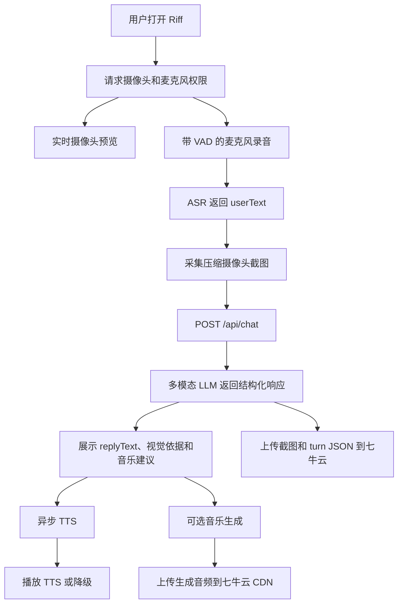

# Riff 架构概览

## 产品形态

Riff 是一个视觉音乐创作伙伴。摄像头不是装饰功能：每一轮对话都必须把摄像头截图作为 AI 回复的一部分依据。

产品有意避开高风险承诺，例如精准面部情绪识别或复杂手势语义识别。视觉理解聚焦于：

- 图像是否可用；
- 可见的创作者状态和姿态；
- 明显的动作能量；
- 耳机、键盘、麦克风、乐器、笔记、歌词、屏幕等物体；
- 低光、桌面布置、安静房间感等环境氛围。

## 主流程

## API 边界

前端应调用一个主对话接口：

`POST /api/chat`

该接口接收：

- `sessionId`
- `turnId`
- `userText`
- 压缩后的摄像头 `snapshot`
- 可选的 `motionSignal`
- 可选的 `historySummary`

后端在内部完成多模态理解并返回结构化数据。核心链路中，前端不应串联独立的 `/api/vision` 和 `/api/chat` 调用。

次要接口均为异步：

- `POST /api/tts`
- `GET /api/tts/{jobId}`
- `POST /api/generate`
- `GET /api/generate/{jobId}`

## 存储边界

七牛云用于体现比赛可见的端云协同：

- `snapshots/{sessionId}/{turnId}.webp`
- `turns/{sessionId}/{turnId}.json`
- `sessions/{sessionId}.json`
- `audio/{sessionId}/{assetId}.mp3`

不要存储连续视频，只存关键帧和最终产物。

## 降级规则

应用必须降级，而不是阻塞：

- 无摄像头：继续纯语音模式，但标记视觉失败。
- 截图失败：继续纯文本回复。
- 视觉模型失败：使用文本 LLM 降级，并展示 `vision_api_failed`。
- TTS 失败：保留文本，可选使用浏览器 `SpeechSynthesis`。
- 音乐生成失败：返回预生成演示素材，或展示重试入口。

## 构建优先级

P0:

- 摄像头预览与截图；
- 麦克风 VAD 与 ASR；
- `/api/chat` 结构化响应；
- UI 展示视觉依据；
- 七牛云截图、turn、session 存储。

P1:

- 异步 TTS 打磨；
- 参考音频生成；
- 基础动作能量检测。

P2:

- Spotify 歌单集成。

## 模型选择

默认第一版实现供应商为 OpenAI：

- `gpt-5.4-mini` 用于多模态视觉对话；
- `gpt-5.4-mini` 用于低成本文本降级和摘要；
- `gpt-4o-mini-transcribe` 用于 ASR，`whisper-1` 作为兼容降级；
- 浏览器 `SpeechSynthesis` 作为第一版 TTS 降级。

选型理由见 `docs/architecture/model-selection.md`。
